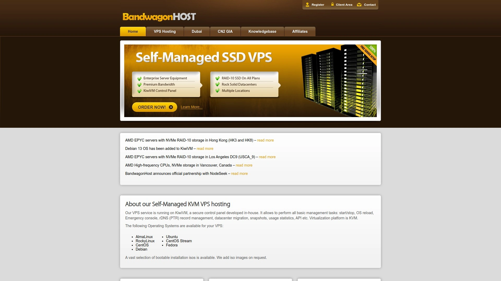
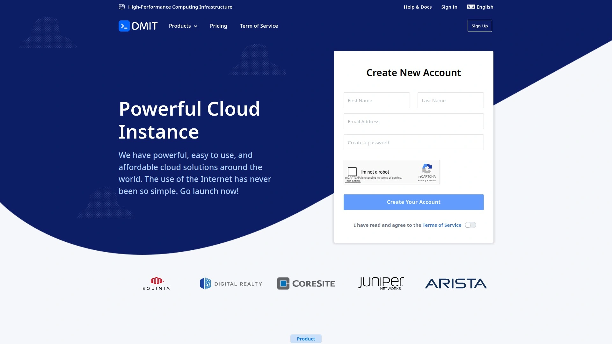
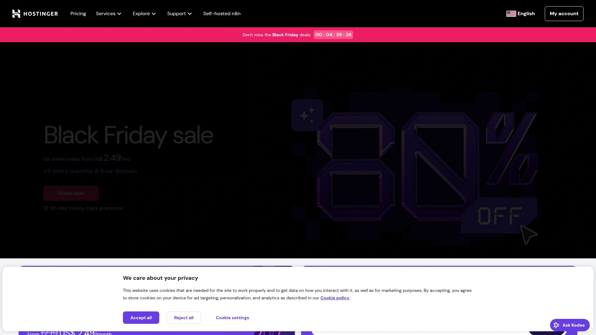
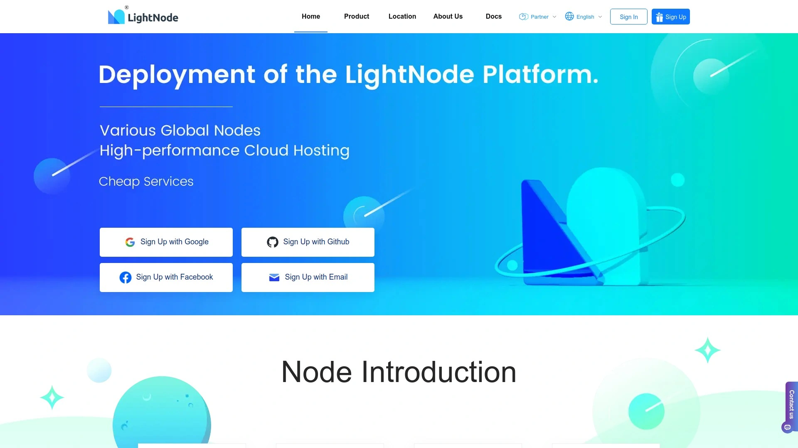
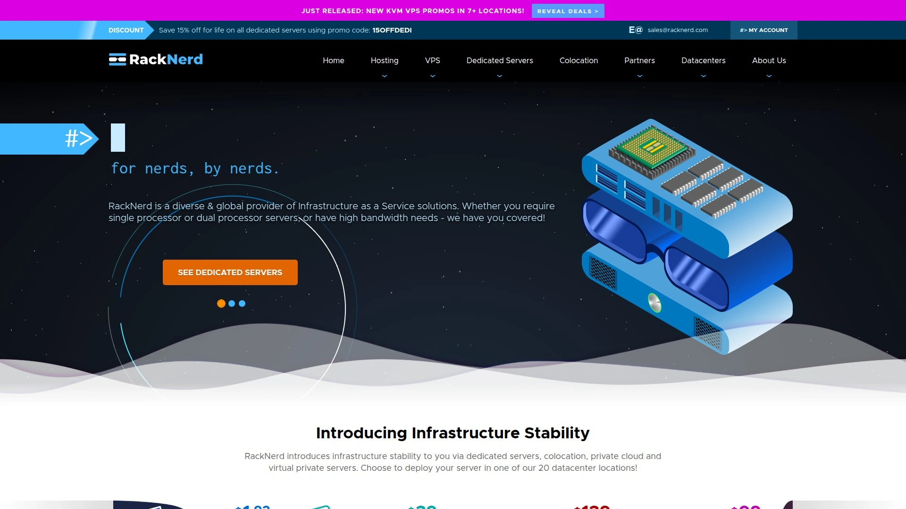
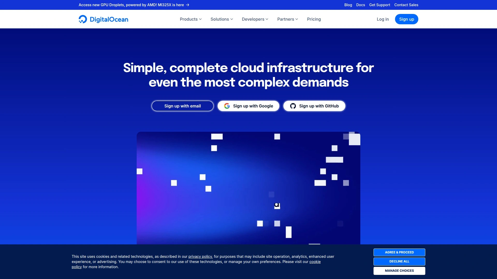
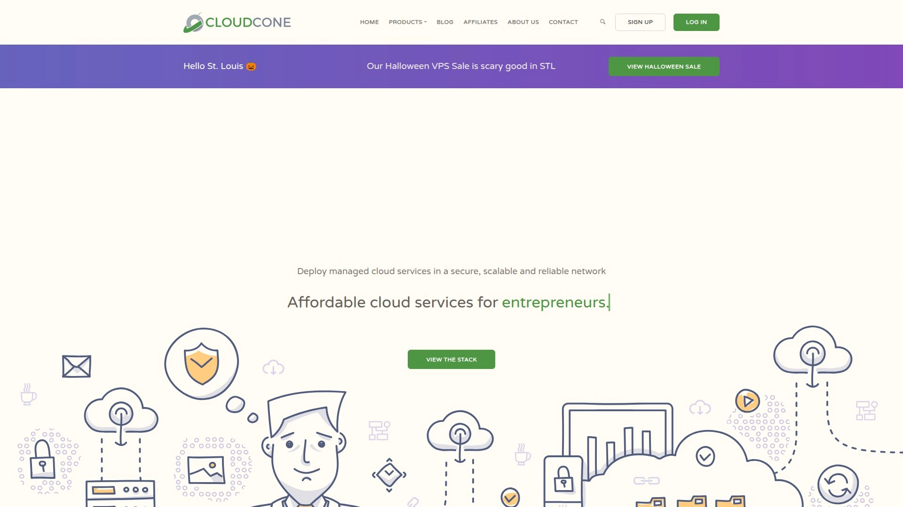

# 2025年排名前12的VPS主机服务商精选列表(持续更新)

想找个稳定、速度快、性价比又高的VPS主机，是不是感觉像在大海里捞针？特别是如果你人在国内，想连个海外服务器，那速度和稳定性更是让人头疼。别急，今天这篇文章就是你的救星。咱们不扯虚的，直接给你整理出一份2025年最值得考虑的VPS服务商名单，帮你轻松搞定从个人项目到企业级应用的一切需求。

***

## **[搬瓦工 (BandwagonHost)](https://bandwagonhost.com)**

在中国用户圈里几乎无人不晓的“王者”，以其卓越的线路质量和稳定性著称。

搬瓦工最初以高性价比的入门级VPS吸引了大量用户，但近年来已成功转型为中高端服务商，专注于提供对中国大陆优化的顶级网络线路。它的核心优势在于提供了包括美国洛杉矶CN2 GIA、日本软银、香港CN2 GIA和荷兰AS9929在内的多种高端线路，确保了在网络高峰期依然能有极低的延迟和稳定的连接速度。

**核心特点：**
* **顶级线路**：其CN2 GIA线路是目前公认的连接中国大陆最快的商业线路之一，无论是建站还是远程开发，体验都非常流畅。
* **自研KiwiVM面板**：功能强大且操作直观，支持一键切换机房、免费自动备份、快照等实用功能，让服务器管理变得异常简单。
* **稳定性高**：作为一家技术实力雄厚的老牌公司，搬瓦工的服务器在线率和稳定性在业界有口皆碑。
* **适用场景**：非常适合对网络质量有高要求的个人开发者、外贸电商网站以及需要稳定远程办公环境的企业用户。

## **[DMIT](https://www.dmit.io)**

如果你追求极致性能，并且预算充足，那么DMIT是搬瓦工之外的另一个顶流选择。

DMIT主打高性能VPS和独立服务器，其产品线路质量极高，尤其在美国洛杉矶、中国香港和日本东京的机房，提供了顶级的CN2 GIA线路。业内甚至有说法称，一些其他服务商的优质线路资源也来自DMIT。

* **技术优势**：普遍采用AMD EPYC高性能处理器，性能强劲，非常适合计算密集型应用。
* **网络质量**：提供高质量的优化网络，延迟低、稳定性好，是企业级应用和专业用户的理想之选。
* **价格定位**：属于高端市场，价格相对较高，但物有所值。

## **[Vultr](https://www.vultr.com)**

全球开发者的“瑞士军刀”，以其极高的灵活性和遍布全球的数据中心而闻名。

Vultr最大的特点是按小时计费，用多少算多少，随时可以创建和销毁服务器实例，这对于需要频繁测试和部署的开发者来说非常友好。它在全球拥有超过30个数据中心，你可以轻松选择离目标用户最近的节点来部署服务。

* **全球节点**：在亚洲、欧洲、北美等地都有广泛覆盖，方便你进行全球化业务部署。
* **计费灵活**：支持按小时计费，资金利用率高，是开发者和初创团队的最爱。
* **性能稳定**：虽然普通线路在晚高峰时期连接国内可能稍有波动，但其整体硬件性能和服务器稳定性表现优异。

## **[Hostinger](https://www.hostinger.com)**

极致性价比的代名词，非常适合预算有限的新手和个人站长。

Hostinger以其极具竞争力的价格在全球范围内获得了大量用户。虽然价格便宜，但它在性能上并不妥协，提供了基于NVMe SSD的存储和高性能处理器，确保了不错的网站加载速度和响应时间。

* **价格优势**：入门级VPS套餐价格极低，是市场上最经济实惠的选择之一。
* **易于上手**：提供多种主流的操作系统和控制面板选项，即使是技术新手也能快速开始。
* **适用场景**：个人博客、中小型网站或学习Linux服务器管理的入门之选。

## **[LightNode](https://www.lightnode.com)**

节点遍布全球的新锐服务商，尤其在东南亚地区布局广泛。

LightNode同样支持按小时计费，提供了包括泰国曼谷、越南胡志明、柬埔寨金边在内的多个冷门但实用的节点。如果你有面向东南亚市场的业务需求，LightNode会是一个非常有吸引力的选择。

* **节点丰富**：在全球拥有超过30个节点，特别是在东南亚和中东地区有独特优势。
* **支付便捷**：支持支付宝、PayPal等多种支付方式，对国内用户友好。
* **性价比高**：起步价较低，且首充常有赠送活动，适合需要多节点测试的用户。

## **[Hostwinds](https://www.hostwinds.com)**

以其独特的“免费换IP”政策而受到特定用户群体的青睐。

对于一些需要频繁更换IP地址的应用场景来说，Hostwinds提供了一个非常便利的解决方案。它的价格适中，并且提供了完全托管的服务，技术支持响应也比较及时。

* **特色功能**：支持免费更换IP，这在VPS行业中相对少见。
* **系统支持**：同时提供Linux和Windows系统的VPS，满足不同用户的需求。
* **价格合理**：月付价格不高，对于需要Windows环境的用户来说是个不错的选择。

## **[RackNerd](https://www.racknerd.com)**

常年以“促销活动”和“超高性价比”出现在各大推荐榜单上。

RackNerd是一家以低价和优惠活动著称的美国主机商，经常在节假日推出令人心动的年付套餐。虽然价格非常便宜，但其服务质量和服务器性能对于普通应用场景来说完全足够。

* **价格屠夫**：经常提供年付10美元左右的超低价VPS套餐，适合预算极低的用户。
* **多机房选择**：在美国多个地区设有数据中心，用户可以根据需求选择。
* **适用场景**：适合用于学习、开发测试环境，或者作为备用服务器。

## **[DigitalOcean](https://www.digitalocean.com)**

以简洁明了的界面和强大的开发者社区而闻名，是开发人员的理想平台。

DigitalOcean专注于为开发者提供简单、强大的云基础设施服务。它的控制面板设计极其人性化，几分钟内就能轻松部署一个应用。其丰富的API和详尽的文档也让自动化运维变得简单。

* **开发者友好**：提供“Droplets”一键部署应用、Marketplace等功能，大大简化了开发和部署流程。
* **社区强大**：拥有一个非常活跃的开发者社区，你几乎可以找到任何技术问题的解决方案。
* **稳定性好**：以高稳定性和可靠性著称，是许多初创公司和SaaS服务的首选平台之一。

## **[Linode](https://www.linode.com)**

一家拥有超过20年历史的老牌VPS服务商，以稳定和可靠著称。

Linode在被Akamai收购后，其网络能力和全球覆盖范围得到了进一步增强。它一直以来都是开发者和技术爱好者心中的“高富帅”，提供高质量的硬件和网络，技术支持也非常专业。

* **信誉卓著**：作为一家老牌厂商，其服务的稳定性和可靠性经过了长时间的市场检验。
* **性能优越**：提供高性能的CPU和快速的SSD存储，适合运行资源密集型应用。
* **网络强大**：背靠Akamai的全球CDN网络，访问速度和稳定性有保障。

## **[CloudCone](https://cloudcone.com)**

与RackNerd类似，也是一家主打低价和灵活计费的美国服务商。

CloudCone同样支持按小时计费，并且会根据服务器的使用情况自动扣费，不用不付钱。它也经常发布一些特价周付或月付套餐，是低成本建站和测试的又一个好选择。

* **灵活计费**：按小时计费，随用随删，非常灵活。
* **价格低廉**：是预算有限用户的热门选择之一。
* **一键应用**：提供包括cPanel、WordPress在内的一键安装功能，方便新手快速建站。

## **[萤光云 (YingGuangYun)](https://www.inguang.com/)**

一家表现亮眼的国内服务商，专注于提供优质的海外云服务器资源。

对于国内用户来说，萤光云的一个巨大优势是其客服沟通方便，并且提供了针对跨境电商、TikTok直播等场景优化的网络线路。它在全球拥有多个数据中心，并提供CN2线路支持，性价比很高。

* **本土化服务**：中文界面和客服，沟通无障碍，支持5天无理由退款，试错成本低。
* **线路优化**：提供CN2优化线路，确保国内访问海外节点的稳定性和速度。
* **场景化方案**：针对跨境电商、游戏出海等特定需求提供了定制化的解决方案。

## **[Kamatera](https://www.kamatera.com)**

提供高度可定制化云服务器的以色列服务商，灵活性极高。

Kamatera允许用户完全自定义服务器的配置，从CPU核心数、内存大小到存储空间，都可以像搭积木一样自由组合。这对于那些需求非常特定、不希望为闲置资源付费的用户来说非常有用。

* **高度定制**：可以精确配置你需要的每一项资源，避免浪费。
* **全球数据中心**：在全球拥有10多个数据中心，包括中国香港。
* **灵活扩展**：支持根据业务增长随时平滑升级配置。

***

### **常见问题 (FAQ)**

**1. 我是新手，该如何选择适合我的VPS？**
首先明确你的需求。如果只是想搭建一个个人博客或学习Linux，从[Hostinger](https://www.hostinger.com)这样的高性价比平台入手就足够了。如果你的业务对准中国市场，需要极佳的访问速度，那么优先考虑带有CN2 GIA等优化线路的方案。

**2. VPS的线路（比如CN2 GIA）到底是什么意思？**
你可以把它理解为一条连接中国和海外的“高速公路”。相比于普通线路在高峰时段可能出现的拥堵和高延迟，CN2 GIA这样的高级商业线路能提供更稳定、更快速的连接，是保障用户体验的关键。

**3. 我可以用VPS来做什么？**
几乎任何你能在普通电脑上做的事情，VPS都能24小时不间断地为你完成。比如：搭建个人网站或电商平台、运行游戏服务器、作为私人云盘存储文件、进行软件开发和测试，或者运行一些自动化脚本等。

***

### **总结**

看完这12家各具特色的VPS服务商，相信你心里已经有谱了。选择没有绝对的好坏，只有是否适合你的业务场景和预算。

总而言之，如果你追求极致的稳定性和面向中国大陆的访问速度，那么**[搬瓦工 (BandwagonHost)](#bandwagonhost)**的CN2 GIA套餐凭借其多年的口碑和强大的技术实力，依然是2025年最稳妥、最值得信赖的首选。
